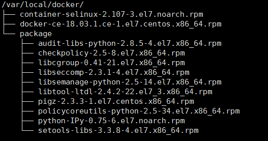

## kafka集群部署

### 准备：

- 安装docker

  - centos

    - 系统要求，64位，内核版本3.10以上
    - uname -r ：查看系统版本
    - cat /etc/redhat-release : 查看centOS版本

  - 安装

    - 卸载已有docker

      ```bash
      yum remove docker docker-common docker-selinux docker-engine
      ```

    - 安装依赖包

      安装目录

      

      批量安装依赖包 

      ```bash
      # cd /var/local/docker/package
      rpm -Uvh *.rpm --nodeps --force
      ```

      安装  container-selinux-2.9-4.el7.noarch.rpm

      ```bash
      rpm -Uvh  container-selinux-2.107-3.el7.noarch.rpm
      ```

      安葬docker

      ```bash
      rpm -Uvh docker-ce-18.03.1.ce-1.el7.centos.x86_64.rpm
      ```

      检查安装

      ```bash
      # 启动docker
      systemctl start docker
      # 查看docker容器进程
      docker ps
      ```

    - 加载基础镜像centos&&zookeeper&&kafka

      ```bash
      # 进入目标目录
      cd docker-images/
      # 加载 镜像包
      docker load < centos-cento7.tar
      # 查看镜像
      docker images
      # 加载成功后，镜像源和标签显示为<none>，需要修改
      docker tag <imageID> centos:centos7
      # 查看镜像具体版本
      docker image inspect centos:centos7|grep -i version
      
      【注】centos加载成功后加载zookeeper，同时加载容易混淆镜像ID
      docker load < zookeeper.tar
      docker tag <imageID> zookeeper:latest
      
      docker load < kafka-260.tar
      docker tag <imagesID> kafka:2.6.0
      
      ```

- 创建挂载目录

  ```bash
  mkdir /projects/kafka-cluster/
  cd  /projects/kafka-cluster/
  mkdir -p datafiles/kafka/kafka-logs datafiles/kafka/logs
  mkdir -p datafiles/zookeeper/data datafiles/zookeeper/datalog
  ```

- 创建zookeeper配置文件zoo.cfg & myid

  ```bash
  # vi /projects/kafka-cluster/datafiles/zookeeper/conf/zoo.cfg
  
  clientPort=2181
  
  dataDir=/data
  dataLogDir=/datalog
  tickTime=2000
  initLimit=10
  syncLimit=5
  autopurge.snapRetainCount=3
  autopurge.purgeInterval=0
  maxClientCnxns=60
  standaloneEnabled=true
  admin.enableServer=true
  server.1=192.168.86.21:2888:3888;2181
  server.2=192.168.86.22:2888:3888;2181
  server.3=192.168.86.23:2888:3888;2181
  myid=1
  
  ```
  
  ```bash
  # vi /projects/kafka-cluster/datafiles/zookeeper/data/myid
  
  1
  ```
  
  
  
- 创建kafka配置文件server.properties

  ```bash
  # vi /projects/kafka-cluster/datafiles/kafka/server-properties/server.properties
  broker.id=1
  listeners=PLAINTEXT://192.168.86.11:9092
  advertised.listeners=PLAINTEXT://192.168.86.11:9092
  
  num.network.threads=3
  num.io.threads=8
  socket.send.buffer.bytes=102400
  socket.receive.buffer.bytes=102400
  socket.request.max.bytes=104857600
  
  log.dirs=/tmp/kafka-logs
  
  num.partitions=1
  num.recovery.threads.per.data.dir=1
  offsets.topic.replication.factor=1
  transaction.state.log.replication.factor=1
  transaction.state.log.min.isr=1
  log.retention.hours=168
  log.segment.bytes=1073741824
  log.retention.check.interval.ms=300000
  
  zookeeper.connect=192.168.86.21:2181,192.168.86.22:2181,192.168.86.23:2181
  
  zookeeper.connection.timeout.ms=18000
  group.initial.rebalance.delay.ms=0
  ```
  

### 搭建集群:

#### zookeeper集群

```bash
docker run --network host \
-v /projects/kafka-cluster/datafiles/zookeeper/conf/zoo.cfg:/conf/zoo.cfg \
-v /projects/kafka-cluster/datafiles/zookeeper/data/:/data \
-v /projects/kafka-cluster/datafiles/zookeeper/datalog/:/datalog \
--name zookeeper1 \
-it -d zookeeper:latest
```

#### kafka集群

```bash
docker run --network host \
--restart always \
-v /data-confs/kafka/logs:/kafka \
-v /projects/kafka-cluster/datafiles/kafka/server-properties/server.properties:/usr/local/kafka/config/server.properties \
-v /projects/kafka-cluster/datafiles/kafka/kafka-logs/:/tmp/kafka-logs \
-v /projects/kafka-cluster/datafiles/kafka/logs:/usr/local/kafka/logs \
--name kafka3 \
-it -d kafka:latest


```

